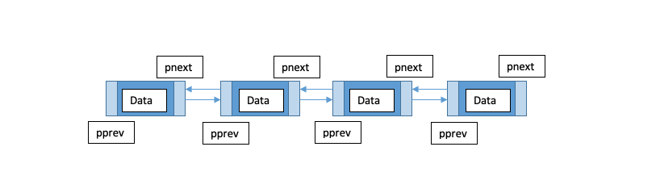

# LINKED LIST

## Introduction
A linked list is a linear data structure. Elements in a linked list are not stored at a contiguous memory location. In this section, we will focus on doubly linked lists that will just be referred to as 'linked list' for the rest of the section. All the elements in a linked list are "linked" together by pointers (pnext and pprev). The data, pprev, and pnext together are referred to as a node. Each node has a pointer that is pointing to the previous node and another pointing to the next node. The first node in a linked list is referred to as being the "head" and the last node being referred to as the "tail".
## Uses of Linked List
Can be used in making navigation systems where both front and back navigation is required. Linked list is used in web browsers to allow for a back and forward button to work on visited web pages. It can also be used to implement undo and redo functionality.
## Linked List vs. Array

The Advantages of Linked List over Arrays:
- Linked List have dynamic size unlike arrays.
- It is easy to insert and delete from a linked list. 
  
The disadvantages of Linked List over Arrays:
- Random access is not allowed in a linked list. In order to access an element, the search has to start from the first node and go sequentially through the linked list to get to the element.
- There is extra memory needed for each element because two pointers are needed to be with each node.
- A linked list is not cache friendly. Array elements are contiguous locations, while that is not true for a linked list.
## Performance
| Linked List Operations | Description                                               | Performance |
| ---------------------- | --------------------------------------------------------- | ----------- |
| insert_head(value)     | Adds "value" before the head.                             | O(1)        |
| insert_tail(value)     | Adds "value" after the tail.                              | O(1)        |
| insert(i, value)       | Adds "value" after node "i".                              | O(n)        |
| remove_head()          | Removes the first item.                                   | O(1)        |
| remove_tail(index)     | Removes the last item.                                    | O(1)        |
| remove()               | Removes node "i".                                         | O(n)        |
| size()                 | Returns the size of the linked list.                      | O(1)        |
| empty()                | Returns true if the length of the linked list is zero.    | O(1)        |
## Example

Here is an example of basic implementation of a linked list. There is a method of insert into the linked list by inserting after the given node.
```python
class Linked_list:

    class Node:

        def __init__(self, data):
            # Initialize the node.
            self.data = data
            self.next = None
            self.prev = None
    
    def __init__(self):
        # Initialize empty linked list.
        self.head = None
        self.tail = None

    def insert(self, value, new_value):
        current = self.head

        # Search for the value to know where to insert after.
        while current is not None:
            if current.data == value:
                new_node = Linked_list.Node(new_value)
                new_node.prev = current
                new_node.next = current.next

                current.next.prev = new_node
                current.next = new_node
            
            current = current.next
```
## Problem to Solve

Here is a problem to solve. Here the problem is to solve how to implement insert_head() method. There are some hopefully helpful 'to-do' comments to help with solving the problem.
```python
class Linked_list:

    class Node:

        def __init__(self, data):
            # Initialize the node.
            self.data = data
            self.next = None
            self.prev = None
    
    def __init__(self):
        # Initialize empty linked list.
        self.head = None
        self.tail = None
#################################################
# PROBLEM TO SOLVE
#################################################
    def insert_head(self, value):
        # TODO:
        # Create a new node.
        
        # TODO:
        # If list is empty, point both head and tail to the new node.

        # TODO:
        # If list is not empty, only head will change.

#################################################
# END OF PROBLEM
#################################################

    def insert_tail(self, value):
        # Insert a new node at the back of the linked list.
        new_node = Linked_list.Node(value)
        
        new_node.prev = self.tail
        self.tail.next = new_node
        self.tail = new_node 
```

You can check your code with the solution here: [Solution](linked_list_solution.py)


[Back to Welcome Page](welcome.md)