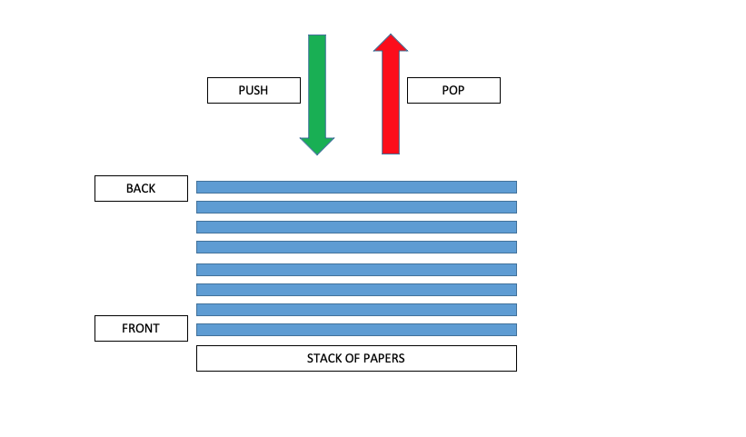
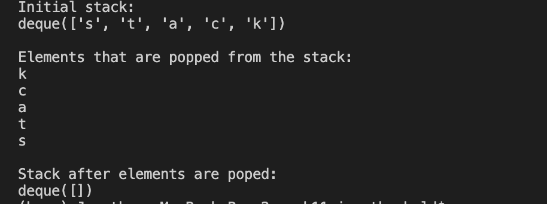

# STACK


## Introduction
A stack is a linear data structure that follows a particular order in which the stack operations are performed. The order of operations is normally described as First In Last Out or Last In First Out. 

A stack works in a similar way as a stack of papers. For this example, the rule will be that a person can only place a paper or remove a paper from the top of the stack. If a person wants to go through this stack of papers, they must pull (pop operation) one paper at a time from the top of the pile to get through all the papers. If a person wants to add (push operation) a paper to the stack, they have to place the paper on the top of the pile. The bottom paper (front of the stack) was the first paper to be placed in the pile. The top paper (back of the stack) was the last to be placed.



## Uses of Stack

A common use of a stack data structure is in using it to implement an undo option in an editor or word processor. Another way that stack is used is in the case of needing to do a string reversal.

## Performance

Here are some of the common stack operations and how fast they are if the stack is using a dynanmic array to make the stack.
| Stack Operations | Description                                               | Performance |
| ---------------- | --------------------------------------------------------- | ----------- |
| push(value)      | Pushes the value on to the back of the stack.             | O(1)        |
| pop()            | Removes or pops the last item from the back of the stack. | O(1)        |
| size()           | Returns the size of the stack.                            | O(1)        |
| empty()          | Returns true or false if the length of the stack in zero. | O(1)        |

## Example

```python
# A simple example of a stack implementation using deque.
from collections import deque
 
stack = deque()
 
# Push element into the stack.
stack.append('s')
stack.append('t')
stack.append('a')
stack.append('c')
stack.append('k')
 
print('Initial stack:')
print(stack)
 
# Pop element from stack in last in first out (LIFO) order.
print('\nElements that are popped from the stack:')
print(stack.pop())
print(stack.pop())
print(stack.pop())
print(stack.pop())
print(stack.pop())
 
print('\nStack after elements are poped:')
print(stack)
```

Here is the output when you run this code:


## Problem to Solve

Here is a problem to solve. The goal is to reverse the string using a stack. Some code is provided to get you started. The only method that is needed is the "reverse_string()" method.
```python
from collections import deque

class Stack():
    def __init__(self):
        self.stack = deque()

    def push(self, value):
        self.stack.append(value)

    def pop(self):
        return self.stack.pop()

    def empty(self):
        return self.stack == deque()

    def get_stack(self):
        return self.stack

###########################################
# PROBLEM TO SOLVE
###########################################
def reverse_string(stack, input_str):
    #TODO:
    pass

###########################################
# END OF PROBLEM
###########################################
stack = Stack()
input_str = input("Please enter a word: ")

print(reverse_string(stack, input_str))
```
You can check your code with the solution here: [Solution](stack_solution.py)


[Back to Welcome Page](welcome.md)