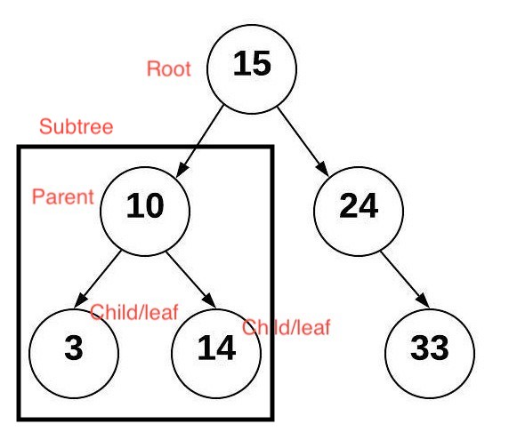

# Trees

## Introduction

A tree can be thought of as having similar properties of a linked list. Trees, akin to linked lists, have pointers pointing to nodes. Unlike linked lists, trees can have multiple different nodes. In this section we will focus on binary trees and binary search trees. A binary tree can link to no more than two nodes. The top node is referred to as the root node. The nodes that have no other connections to nodes are referred to as leaf nodes. A node that has nodes connected to it is called a parent node. The nodes that are connected to the parent node are called child nodes. The left and the right side of the binary tree form a subtree. It is common to have the child nodes point back to their parent node.

A binary search tree has the properties of a binary tree, but has some additional rules for how data is handled and put into the tree. The data will be compared to the parent node of the tree before it is put into the tree. If the data is less than the parent node, then it will be put in the left subtree. If the data is greater than the parent node, then it is put in the right subtree. Duplicates will be either left or right of the root node. By doing this, the tree is sorted.
Some of the operations of a BST (binary search tree) use recursion.

## Recursion

Recursion is where a function calls on itself. An example is:
```python
def hello_world():
    print("Hello World!")
    # recursive call
    hello_world()
```
The problem with this code is that it will call itself forever. This is a problem that has to be addressed in order to use recursion correctly and effectively. 

When using recursion, there are two important rules that have to be followed. These rules are:
- Smaller Problem - When a function is called recursively, we need to make sure we are calling the function on a smaller problem. Without this rule, the function will run forever.
- Base Case - As a function is being called on a smaller problem, there is need for a stopping condition. There has to be a scenario in which recursion is done.

This is using the two rules to fix the above code:
```python
def hello_world(count):
    # Base Case
    if count <= 0:
        return
    else:
        print("Hello World!")
        # Smaller Problem
        hello_world(count - 1)
```
The two rules of recursion are addressed in the code now and will result in the code only running until the new condition is reached. It is important to point out that recursion should not be used everywhere, and that recursion can result in significant performance problems. However, when used correctly, a simple solution can be found to complex problems.

## Uses of Trees

It is used in many search applications where data is constantly entering and leaving. Another place it is used in is in almost every 3D video game to determine what objects need to be rendered. It is also used in almost every high-bandwidth router for storing router-tables.

## Performance

| BST Operations   | Description                                                                                  | Performance |
| ---------------- | -------------------------------------------------------------------------------------------- | ----------- |
| insert(value)    | Insert the value into the tree.                                                              | O(log n)    |
| remove(value)    | Removes a value from the tree.                                                               | O(log n)    |
| contains()       | Returns if a value is in the tree.                                                           | O(log n)    |
| traverse_forward | Visits all nodes from smallest to largest.                                                   | O(log n)    |
| traverse_reverse | Visits all nodes from largest to smallest.                                                   | O(log n)    |
| height(node)     | Determines the height of a node. If height of the tree is needed, the root node is provided. | O(log n)    |
| size()           | Returns the size of the tree.                                                                | O(1)        |
| empty()          | Returns true or false if the root node is empty.                                             | O(1)        |

## Example

Here is an example of the basic implementation of a BST. There is a method to insert a node with data in it. In the insert methods there is use of recursion done to find the empty location to insert the node with new data.
```python
class BST:
    
    class Node:

        def __init__(self, data):
            # Initialize node.
            self.data = data
            self.left = None
            self.right = None

    def __init__(self):
        #Initialize empty BST.
        self.root = None

    def insert(self, data):
        if self.root is None:
            self.root = BST.Node(data)
        else:
            self._insert_(data, self.root)

    def _insert_(self, data, node):
        # Will look for a place to insert a node with data.
        if data != node.data:
            if data < node.data:
                # The data belongs on the left side.
                if node.left is None:
                    node.left = BST.Node(data)
                else:
                    # Call _insert_ recursively on the left sub-tree.
                    self._insert_(data, node.left)
            else:
                # The data belongs on the right side.
                if node.right is None:
                    node.right = BST.Node(data)
                else:
                    # Call _insert_ recursively on the right sub-tree.
                    self._insert_(data, node.right)
```

## Problem to Solve

Here is a problem to solve. The problem is to find the minimum value in the BST. There is some code already there to get you started. The problem will test your knowledge of a BST.

```python
class BST:
    
    class Node:

        def __init__(self, data):
            # Initialize node.
            self.data = data
            self.left = None
            self.right = None

    def __init__(self):
        #Initialize empty BST.
        self.root = None

    def insert(self, data):
        if self.root is None:
            self.root = BST.Node(data)
        else:
            self._insert_(data, self.root)

    def _insert_(self, data, node):
        # Will look for a place to insert a node with data.
        if data != node.data:
            if data < node.data:
                # The data belongs on the left side.
                if node.left is None:
                    node.left = BST.Node(data)
                else:
                    # Call _insert_ recursively on the left sub-tree.
                    self._insert_(data, node.left)
            else:
                # The data belongs on the right side.
                if node.right is None:
                    node.right = BST.Node(data)
                else:
                    # Call _insert_ recursively on the right sub-tree.
                    self._insert_(data, node.right)

#########################################
# PROBLEM TO SOLVE
#########################################
def min_value(root):
    #TODO:
    pass
#########################################
# END OF PROBLEM
#########################################

bst = BST()

bst.insert(6)
bst.insert(3)
bst.insert(4)
bst.insert(5)
bst.insert(10)

print("This is the smallest value in the BST: {}".format(min_value(bst)))
```
You can check your code with the solution here: [Solution](tree_solution.py)


[Back to Welcome Page](welcome.md)